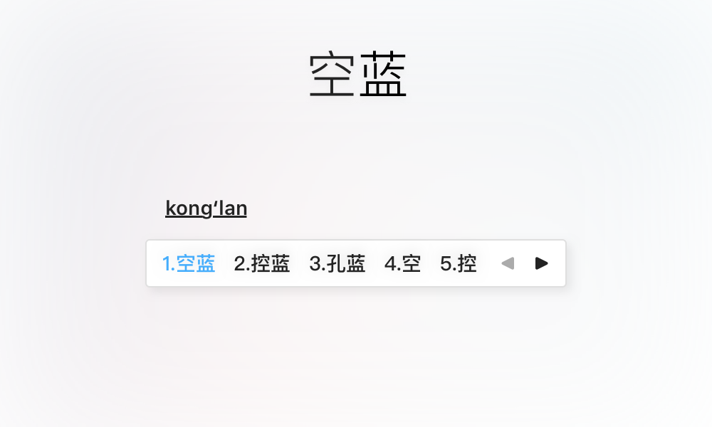
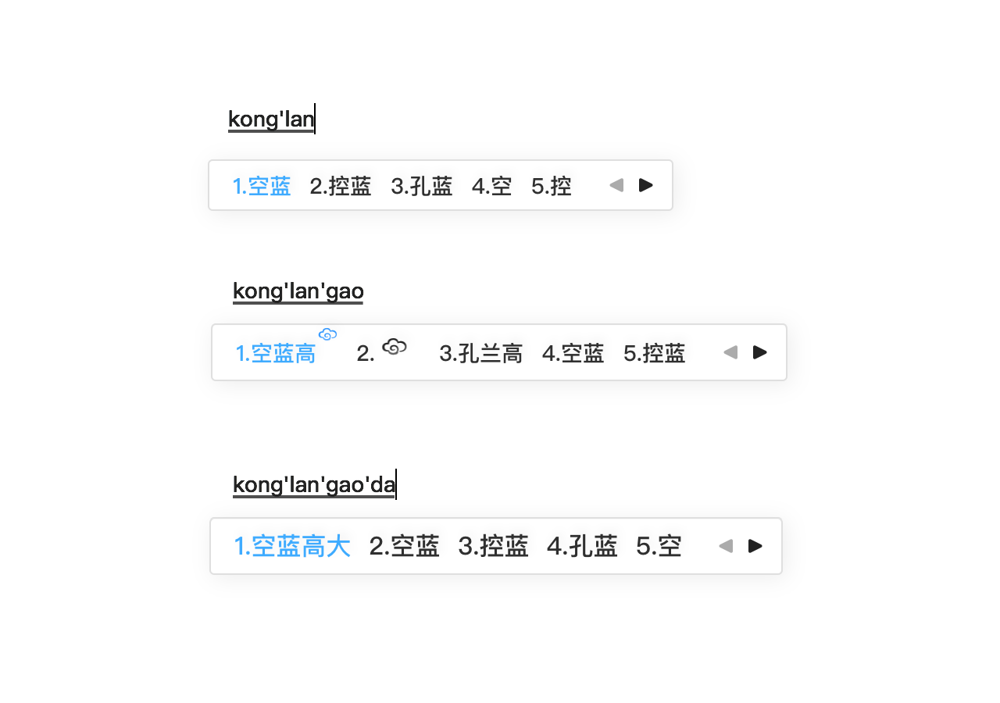

# 空蓝 PureBlue

一款搜狗输入法 for Mac 皮肤，极简风格，使用蓝色作为高亮颜色。

提供多个版本：

## 安装

1. 确保在 macOS 系统中已经安装[搜狗输入法 for Mac](https://pinyin.sogou.com/mac/introduce.php)；
2. 下载喜欢的皮肤文件：
   - [~~PureBlue.mssf~~](https://github.com/intret/PureBlue/raw/master/PureBlue.mssf)（文字居下，强迫症不要下这个原始的版本了） 
   - [空蓝.mssf](https://github.com/intret/PureBlue/raw/master/空蓝.mssf)（文字居中）
   - [空蓝高.mssf](https://github.com/intret/PureBlue/raw/master/空蓝高.mssf) （文字居中，整个皮肤整体高一点）
   - [空蓝高大.mssf](https://github.com/intret/PureBlue/raw/master/空蓝高大.mssf) （文字居中，整个皮肤整体高一点，文字大一点）
3. 在 Finder 中打开 .mssf 文件即可完成皮肤安装，重复打开文件则会覆盖安装。

## 参考

[搜狗皮肤Store for Mac](https://pinyin.sogou.com/skins/mac.php)

[搜狗皮肤编辑器 for Mac](https://pinyin.sogou.com/mac/skineditor.php)

# 版权

