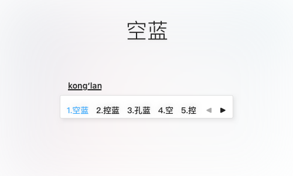

# 空蓝 PureBlue

一款搜狗输入法 for Mac 皮肤，极简风格，使用蓝色作为高亮颜色。

> 因为没有搜索到自己喜欢的极简皮肤，所以花了点时间设计这款皮肤。
>
> 计划设计一系列的极简皮肤，主要是更换颜色：）
>
> 名字都已经想好了：空蓝 星河 清浅 林染 清川 飞絮  寒烟 荒原 ...

## 安装

1. 确保在 macOS 系统中已经安装[搜狗输入法 for Mac](https://pinyin.sogou.com/mac/introduce.php)；
2. 下载 PureBlue.mssf 皮肤文件；
3. 打开 PureBlue.mssf 文件即可完成皮肤安装。

## 参考

[搜狗皮肤Store for Mac](https://pinyin.sogou.com/skins/mac.php)

[搜狗皮肤编辑器 for Mac](https://pinyin.sogou.com/mac/skineditor.php)

# 版权

